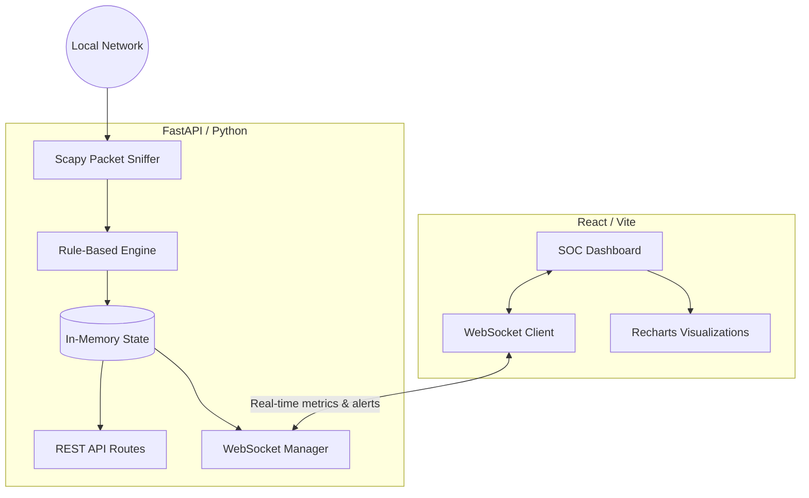

# Real-Time Intrusion Detection and Prevention System (IDPS)


Nexus IDPS is a professional, production-quality Intrusion Detection and Prevention System built for real-time network security monitoring and automated mitigation. It uses a custom rule-based detection engine powered by Scapy and a highly responsive, modern SOC-style dashboard built with React and Tailwind CSS.

## 🌟 Features

* **Real-Time Traffic Analysis**: Monitors live network packets using Scapy.
* **Rule-Based Threat Detection**: Detects DoS Attacks, SYN Floods, ICMP/UDP Floods, Port Scans, ARP Spoofing, and more.
* **Automated Mitigation**: Simulates prevention by dynamically blocking and ignoring traffic from malicious IP addresses in memory.
* **Modern SOC Dashboard**: Dark-themed, beautiful, real-time UI built with React, Recharts, and Framer Motion.
* **WebSocket Integration**: Instantaneous updates pushed from backend to frontend without polling.
* **No Database Required**: Fully in-memory state for lightning-fast performance, suitable for college projects or lightweight network monitoring.

---

## 🏗️ Project Architecture



---

## 📂 Folder Structure

```text
IDPS/
├── backend/                  # Python FastAPI Backend
│   ├── app/
│   │   ├── api/
│   │   │   └── routes.py     # REST API endpoints
│   │   ├── core/
│   │   │   ├── capture.py    # Scapy packet capture
│   │   │   ├── detection.py  # Threat detection rules
│   │   │   ├── state.py      # In-memory tracking & state
│   │   │   └── websocket.py  # Real-time WebSockets
│   │   ├── config.py         # Configurable detection thresholds
│   │   └── __init__.py
│   ├── main.py               # FastAPI entry point
│   └── requirements.txt      # Python dependencies
└── frontend/                 # React Vite Frontend
    ├── src/
    │   ├── components/       # Reusable UI components
    │   │   └── Dashboard.tsx # Main dashboard view
    │   ├── hooks/
    │   │   └── useWebSocket.ts # WS connection hook
    │   ├── App.tsx           # Layout and routing
    │   ├── index.css         # Tailwind & Shadcn global styles
    │   └── main.tsx          # React entry point
    ├── tailwind.config.js    # Tailwind configuration
    ├── postcss.config.js     # PostCSS configuration
    └── package.json          # Node dependencies
```

---

## 🚀 Installation Guide

### Prerequisites
* Python 3.9+
* Node.js v20+ (with npm)
* Linux OS (Ubuntu recommended) for raw socket capture

### 1. Setup Backend
Open a terminal and navigate to the project root:
```bash
# Create a virtual environment
python3 -m venv venv
source venv/bin/activate

# Install dependencies
pip install -r backend/requirements.txt

# Run the backend
# NOTE: Run with sudo if you want real packet capture, otherwise it will fall back to mock traffic
cd backend
sudo ../venv/bin/uvicorn main:app --host 0.0.0.0 --port 8000
```

### 2. Setup Frontend
Open a new terminal and navigate to the `frontend` directory:
```bash
cd frontend

# Install dependencies
npm install

# Start the development server
npm run dev
```

---

## 📖 User Manual & Demo Guide

### Accessing the Dashboard
1. Open your browser and navigate to `http://localhost:3000` (or the port Vite provides).
2. The dashboard will automatically connect to the WebSocket server at `ws://localhost:8000/ws`.
3. If connected successfully, the "Engine Online" indicator in the top right will turn green.

### How to Demo
If you are running the backend **without sudo**, it will automatically detect the lack of raw socket permissions and fall back to **Mock Packet Generation**. This makes it incredibly easy to demonstrate the UI!

1. **Watch the Traffic Spike**: The mock generator will periodically inject simulated bursts of traffic (e.g., 100 SYN packets in a row).
2. **Observe the Alerts**: You will see the "Active Alerts" counter rise and new alerts populate the "Recent Detections" panel (e.g., SYN Flood, Port Scan, Unknown Device).
3. **See Auto-Mitigation**: When an attack crosses a critical threshold, the source IP will automatically be added to the "Blocked IPs" list, and further packets from that IP will be dropped.

If running **with sudo**, you can trigger alerts yourself:
* Generate a ping flood: `sudo ping -f <your-ip>`
* Run a quick Nmap scan: `nmap -F <your-ip>`

---

## 🔌 API Documentation

While the primary communication is handled via WebSockets (`/ws`), the following REST endpoints are available for integration:

### `GET /api/status`
Returns the current engine status and total packets processed.
**Response:**
```json
{
  "status": "running",
  "packet_count": 14250
}
```

### `GET /api/alerts`
Retrieves the full history of triggered alerts.
**Response:**
```json
[
  {
    "id": "uuid",
    "timestamp": 1690000000.0,
    "type": "SYN Flood",
    "severity": "Critical",
    "source_ip": "192.168.1.100",
    "dest_ip": "192.168.1.101",
    "reason": "High rate of SYN packets: 120/s"
  }
]
```

### `GET /api/blocked`
Returns a list of currently blocked IP addresses.
**Response:**
```json
[
  "192.168.1.100",
  "10.0.0.5"
]
```

### `POST /api/unblock/{ip}`
Manually removes an IP address from the block list.
**Response:**
```json
{
  "status": "success",
  "message": "IP 192.168.1.100 unblocked"
}
```
