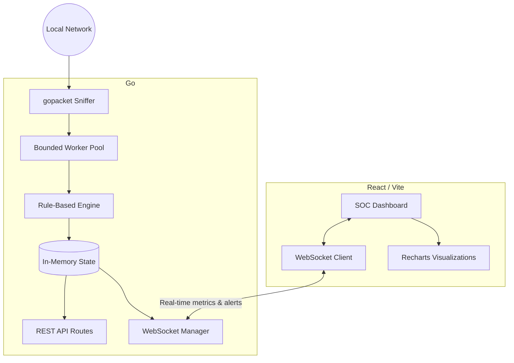

# Real-Time Intrusion Detection and Prevention System (IDPS)


Nexus IDPS is a professional, production-quality Intrusion Detection and Prevention System built for real-time network security monitoring and automated mitigation. It uses a custom rule-based detection engine powered by gopacket (Go) and a highly responsive, modern SOC-style dashboard built with React and Tailwind CSS.

## 🌟 Features

* **Real-Time Traffic Analysis**: Monitors live network packets using `gopacket`.
* **Rule-Based Threat Detection**: Detects DoS Attacks, SYN Floods, ICMP/UDP Floods, DNS Amplification, Port Scans, ARP Spoofing, and more.
* **Automated Mitigation**: Enforces prevention by dynamically adding and removing `iptables` rules at the host or inline gateway level to block malicious IPs.
* **Modern SOC Dashboard**: Dark-themed, beautiful, real-time UI built with React, Recharts, and Framer Motion.
* **WebSocket Integration**: Instantaneous updates pushed from backend to frontend without polling.
* **No Database Required**: Fully in-memory state for lightning-fast performance, suitable for college projects or lightweight network monitoring.

---

## 🏗️ Project Architecture



---

## 📂 Folder Structure

```text
IDPS/
├── backend/                  # Go Backend
│   ├── api/                  # REST API and WebSockets
│   ├── capture/              # gopacket capture logic
│   ├── config/               # Environment configuration
│   ├── detection/            # Threat detection rules
│   ├── firewall/             # iptables management
│   ├── state/                # In-memory thread-safe state
│   ├── go.mod                # Go module file
│   └── main.go               # Go entry point
└── frontend/                 # React Vite Frontend
    ├── src/
    │   ├── components/       # Reusable UI components
    │   │   └── Dashboard.tsx # Main dashboard view
    │   ├── hooks/
    │   │   └── useWebSocket.ts # WS connection hook
    │   ├── App.tsx           # Layout and routing
    │   ├── index.css         # Tailwind & Shadcn global styles
    │   └── main.tsx          # React entry point
    ├── tailwind.config.js    # Tailwind configuration
    ├── postcss.config.js     # PostCSS configuration
    └── package.json          # Node dependencies
```

---

## 🚀 Installation Guide

### Prerequisites
* Go 1.20+
* Node.js v20+ (with npm)
* Linux OS (Ubuntu recommended) for raw socket capture

### 1. Setup Backend
Open a terminal and navigate to the project root:
```bash
# Build the Go binary
cd backend
go build -o idps-backend

# Run the backend with sudo (required for raw packet capture)
sudo ./idps-backend
```

### 2. Setup Frontend
Open a new terminal and navigate to the `frontend` directory:
```bash
cd frontend

# Install dependencies
npm install

# Start the development server
npm run dev
```

---

## 📖 User Manual & Demo Guide

### Accessing the Dashboard
1. Open your browser and navigate to `http://localhost:3000` (or the port Vite provides).
2. The dashboard will automatically connect to the WebSocket server at `ws://localhost:8000/ws`.
3. If connected successfully, the "Engine Online" indicator in the top right will turn green.

### How to Demo
The backend must be run **with sudo** to capture real packets. You can easily trigger alerts yourself to see the dashboard react in real time:

1. **Ping Flood**: Generate a high volume of ICMP packets using the ping flood command:
   ```bash
   sudo ping -f <your-ip>
   ```
2. **Port Scan**: Run an aggressive Nmap scan to trigger the Port Scan rules:
   ```bash
   nmap -F <your-ip>
   ```

You will see the "Active Alerts" counter rise and new alerts populate the "Recent Detections" panel (e.g., ICMP Flood, Port Scan). When an attack crosses a critical threshold, the source IP will automatically be added to the "Blocked IPs" list.

---

## 🔌 API Documentation

While the primary communication is handled via WebSockets (`/ws`), the following REST endpoints are available for integration:

### `GET /api/status`
Returns the current engine status and total packets processed.
**Response:**
```json
{
  "status": "running",
  "packet_count": 14250
}
```

### `GET /api/alerts`
Retrieves the full history of triggered alerts.
**Response:**
```json
[
  {
    "id": "uuid",
    "timestamp": 1690000000.0,
    "type": "SYN Flood",
    "severity": "Critical",
    "source_ip": "192.168.1.100",
    "dest_ip": "192.168.1.101",
    "reason": "High rate of SYN packets: 120/s"
  }
]
```

### `GET /api/blocked`
Returns a list of currently blocked IP addresses.
**Response:**
```json
[
  {
    "ip": "192.168.1.100",
    "rule_id": "NET-SYN-001",
    "reason": "SYN Flood (160 pkts/s)",
    "confidence": "High",
    "created_at": 1690000000.0,
    "expires_at": 1690000600.0
  }
]
```

### `POST /api/block/{ip}`
Manually adds an IP address to the block list and updates `iptables`.
**Response:**
```json
{
  "status": "success",
  "message": "IP 192.168.1.100 blocked"
}
```

### `POST /api/unblock/{ip}`
Manually removes an IP address from the block list and updates `iptables`.
**Response:**
```json
{
  "status": "success",
  "message": "IP 192.168.1.100 unblocked"
}
```

### `DELETE /api/alerts/{id}`
Dismisses a specific alert by its UUID.
**Response:**
```json
{
  "status": "success",
  "message": "Alert dismissed"
}
```

### `GET /api/settings`
Returns the current active network interface and operational configurations.
**Response:**
```json
{
  "INTERFACE": "eth0",
  "IDPS_DEPLOYMENT_MODE": "HOST",
  "IDPS_SECURITY_MODE": "IPS",
  "LAN_INTERFACE": "eth1",
  "WAN_INTERFACE": "eth0"
}
```

### `POST /api/settings`
Updates operational configurations, triggering a hot-reload of the capture engine and firewall rules.
**Request Body:**
```json
{
  "IDPS_SECURITY_MODE": "IDS"
}
```
**Response:**
```json
{
  "status": "success",
  "message": "Configuration applied successfully."
}
```
