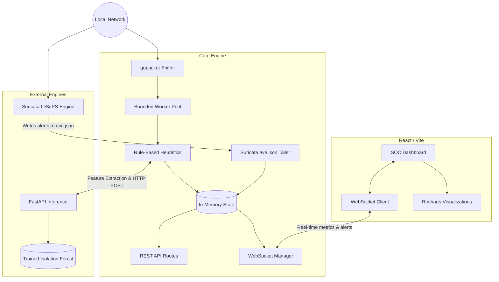

# IDPS: Real-Time Intrusion Detection and Prevention System


## Abstract
The increasing frequency of network attacks requires robust, real-time threat identification and mitigation. Traditional systems often suffer from high resource consumption, complex configurations, and delayed responses. Nexus IDPS is a lightweight, high-performance Intrusion Detection and Prevention System built for real-time monitoring and automated defense. It utilizes a custom Go-based detection engine powered by `gopacket` for raw packet inspection. Threats are mitigated autonomously by dynamically updating host or gateway `iptables` firewalls. The project includes a modern, responsive Security Operations Center (SOC) dashboard built with React, connecting via WebSockets to provide instantaneous, in-memory state updates without traditional database overhead.

## 🌟 Features

* **Hybrid Threat Detection**: Combines a lightning-fast rule-based heuristic engine with a lightweight Machine Learning model (Isolation Forest) for zero-day anomaly detection.
* **Suricata Engine Integration**: Natively integrates with Suricata for deep packet inspection using Emerging Threats (ET) rules via `eve.json` tailing.
* **Real-Time Traffic Analysis**: Monitors live network packets using `gopacket` and dynamically extracts 78 flow features (CICFlowMeter style).
* **Automated Mitigation**: Enforces prevention by dynamically adding and removing `iptables` and `ebtables` rules at the host or inline gateway level to block malicious IPs.
* **Machine Learning Microservice**: A dedicated Python FastAPI inference server serving a pre-trained Scikit-Learn model for advanced traffic classification.
* **Modern SOC Dashboard**: Dark-themed, beautiful, real-time UI built with React, Recharts, and Framer Motion.
* **WebSocket Integration**: Instantaneous updates pushed from backend to frontend without polling.
* **Detailed Threat Library**: Complete reference documentation explaining the meaning, mechanisms, and mitigation for all 33+ detected attack vectors in [ATTACKS.md](file:///home/dell/Downloads/IDPS/ATTACKS.md).
* **No Database Required**: Fully in-memory state for lightning-fast performance, suitable for college projects or lightweight network monitoring.

---

## 🏗️ Project Architecture


```mermaid
graph TD
    subgraph Frontend [React / Vite]
        UI[SOC Dashboard]
        WS_Client[WebSocket Client]
        Charts[Recharts Visualizations]
        
        UI --> Charts
        UI <--> WS_Client
    end

    subgraph Go Backend [Core Engine]
        API[REST API Routes]
        WS_Server[WebSocket Manager]
        State[(In-Memory State)]
        Detection[Rule-Based Heuristics]
        SuricataTail[Suricata eve.json Tailer]
        Capture[gopacket Sniffer]
        WorkerPool[Bounded Worker Pool]
        
        Capture --> WorkerPool
        WorkerPool --> Detection
        Detection --> State
        SuricataTail --> State
        State --> WS_Server
        State --> API
    end
    
    subgraph External Engines
        ML_API[FastAPI Inference]
        ML_MODEL[(Trained Isolation Forest)]
        Suricata[Suricata IDS/IPS Engine]
        
        ML_API --> ML_MODEL
    end

    Detection <-->|Feature Extraction & HTTP POST| ML_API
    Suricata -->|Writes alerts to eve.json| SuricataTail
    WS_Client <-->|Real-time metrics & alerts| WS_Server
    Network((Local Network)) --> Capture
    Network --> Suricata
```

---

## 📂 Folder Structure

```text
IDPS/
├── backend/                  # Go Backend
│   ├── api/                  # REST API and WebSockets
│   ├── capture/              # gopacket capture logic
│   ├── config/               # Environment configuration
│   ├── detection/            # Threat detection rules
│   ├── firewall/             # iptables management
│   ├── flow/                 # CICFlowMeter style tracking
│   ├── state/                # In-memory thread-safe state
│   ├── ml_server.py          # Python ML Inference Microservice
│   └── main.go               # Go entry point
├── frontend/                 # React Vite Frontend
│   ├── src/
│   │   ├── components/       # Reusable UI components
│   │   ├── App.tsx           # Layout and routing
│   │   └── main.tsx          # React entry point
│   └── package.json          # Node dependencies
├── zero_day_model.joblib     # Trained Machine Learning Model
├── feature_scaler.joblib     # Feature Scaler
└── start_all.sh              # Single-command launch script
```

---

## 🚀 Installation Guide

### Prerequisites
* Go 1.20+
* Python 3.12+ (with `pip` and `venv`)
* Node.js v20+ (with npm)
* Suricata (Intrusion Detection Engine)
* Linux OS (Ubuntu/Fedora recommended) for raw socket capture
* `sudo` privileges

### Quick Start (Recommended)
You can start all three services (ML Server, Go Backend, React Frontend) simultaneously using the provided launch script:

```bash
# Ensure the script is executable
chmod +x start_all.sh

# Run the launch script
./start_all.sh
```
This script will automatically set up the Python virtual environment, install ML dependencies, launch the React development server, and prompt for `sudo` to run the Go packet sniffer.

### Manual Setup
If you prefer to run the components manually in separate terminals:

1. **Python ML Server:**
   ```bash
   python3 -m venv .venv
   source .venv/bin/activate
   pip install fastapi uvicorn joblib numpy pydantic scikit-learn pandas
   python backend/ml_server.py
   ```

2. **React Frontend:**
   ```bash
   cd frontend
   npm install
   npm run dev
   ```

3. **Go Backend:**
   ```bash
   cd backend
   go build -o idps-backend
   sudo ./idps-backend
   ```

---

## Configuration

The IDPS is configured via a `.env` file in the `backend/` directory:

```env
API_KEY=your_secure_api_key_here
ALLOWED_ORIGINS=https://your-frontend-domain.com
IDPS_DEPLOYMENT_MODE=GATEWAY # or HOST, NETWORK
IDPS_SECURITY_MODE=IPS       # or IDS
WAN_INTERFACE=eth0           # Internet-facing interface
LAN_INTERFACE=eth1           # Internal network interface
```

### Production Security Requirements

1. **Authentication:** The API requires an `API_KEY` to be set in the backend `.env` file. The frontend must also have this key configured (`VITE_API_KEY`) to authenticate requests.
2. **TLS / SSL:** The Go backend serves standard HTTP. For production, it **must** be deployed behind a TLS-terminating reverse proxy (such as Nginx or Caddy) to secure the API and WebSocket connections. The frontend expects to connect via `https://` and `wss://`.
3. **CORS:** Ensure `ALLOWED_ORIGINS` is strictly configured to your frontend domain to prevent unauthorized access.

---

## 📖 User Manual & Demo Guide

### Accessing the Dashboard
1. Open your browser and navigate to `http://localhost:3000` (or the port Vite provides).
2. The dashboard will automatically connect to the WebSocket server at `ws://localhost:8000/ws`.
3. If connected successfully, the "Engine Online" indicator in the top right will turn green.

### How to Demo
The backend must be run **with sudo** to capture real packets. You can easily trigger alerts yourself to see the dashboard react in real time:

1. **Ping Flood**: Generate a high volume of ICMP packets using the ping flood command:
   ```bash
   sudo ping -f <your-ip>
   ```
2. **Port Scan**: Run an aggressive Nmap scan to trigger the Port Scan rules:
   ```bash
   nmap -F <your-ip>
   ```

You will see the "Active Alerts" counter rise and new alerts populate the "Recent Detections" panel (e.g., ICMP Flood, Port Scan). When an attack crosses a critical threshold, the source IP will automatically be added to the "Blocked IPs" list.

---

## 🔌 API Documentation

While the primary communication is handled via WebSockets (`/ws`), the following REST endpoints are available for integration:

### `GET /api/status`
Returns the current engine status and total packets processed.
**Response:**
```json
{
  "status": "running",
  "packet_count": 14250
}
```

### `GET /api/alerts`
Retrieves the full history of triggered alerts.
**Response:**
```json
[
  {
    "id": "uuid",
    "timestamp": 1690000000.0,
    "type": "SYN Flood",
    "severity": "Critical",
    "source_ip": "192.168.1.100",
    "dest_ip": "192.168.1.101",
    "reason": "High rate of SYN packets: 120/s"
  }
]
```

### `GET /api/blocked`
Returns a list of currently blocked IP addresses.
**Response:**
```json
[
  {
    "ip": "192.168.1.100",
    "rule_id": "NET-SYN-001",
    "reason": "SYN Flood (160 pkts/s)",
    "confidence": "High",
    "created_at": 1690000000.0,
    "expires_at": 1690000600.0
  }
]
```

### `POST /api/block/{ip}`
Manually adds an IP address to the block list and updates `iptables`.
**Response:**
```json
{
  "status": "success",
  "message": "IP 192.168.1.100 blocked"
}
```

### `POST /api/unblock/{ip}`
Manually removes an IP address from the block list and updates `iptables`.
**Response:**
```json
{
  "status": "success",
  "message": "IP 192.168.1.100 unblocked"
}
```

### `DELETE /api/alerts/{id}`
Dismisses a specific alert by its UUID.
**Response:**
```json
{
  "status": "success",
  "message": "Alert dismissed"
}
```

### `GET /api/settings`
Returns the current active network interface and operational configurations.
**Response:**
```json
{
  "INTERFACE": "eth0",
  "IDPS_DEPLOYMENT_MODE": "HOST",
  "IDPS_SECURITY_MODE": "IPS",
  "LAN_INTERFACE": "eth1",
  "WAN_INTERFACE": "eth0"
}
```

### `POST /api/settings`
Updates operational configurations, triggering a hot-reload of the capture engine and firewall rules.
**Request Body:**
```json
{
  "IDPS_SECURITY_MODE": "IDS"
}
```
**Response:**
```json
{
  "status": "success",
  "message": "Configuration applied successfully."
}
```
