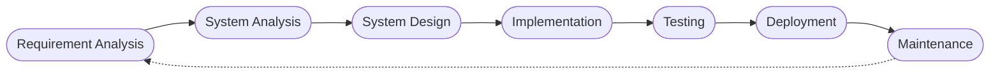
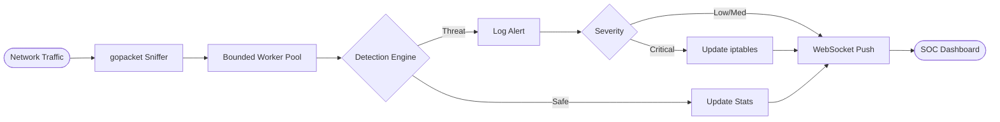

# Nexus IDPS: Real-Time Intrusion Detection and Prevention System

## 1. Abstract
The increasing frequency of network attacks requires robust, real-time threat identification and mitigation. Traditional systems often suffer from high resource consumption, complex configurations, and delayed responses. Nexus IDPS is a lightweight, high-performance Intrusion Detection and Prevention System built for real-time monitoring and automated defense. It utilizes a custom Go-based detection engine powered by `gopacket` for raw packet inspection. Threats are mitigated autonomously by dynamically updating host or gateway `iptables` firewalls. The project includes a modern, responsive Security Operations Center (SOC) dashboard built with React, connecting via WebSockets to provide instantaneous, in-memory state updates without traditional database overhead.

## 2. Existing System
Conventional network security typically relies on manual firewall configurations or resource-heavy legacy intrusion detection systems. Main limitations include **high resource overhead** (requiring substantial memory and heavy databases), **delayed mitigation** (only alerting administrators without blocking), and **complex interfaces** (lacking intuitive, real-time visualizations for quick network health assessment).

## 3. Proposed System
The proposed system is an automated, low-latency IDPS for host and gateway architectures. Key features include a **Go-based Detection Engine** utilizing a bounded worker pool for high-throughput concurrent processing via `gopacket`. It integrates **Automated Firewall Mitigation** directly with Linux `iptables` to block threats in real-time. The **In-Memory Architecture** bypasses database bottlenecks for lightning-fast performance, while the **SOC Dashboard** delivers real-time websocket-driven analytics via React, Recharts, and Framer Motion.

## 4. Objectives
* **Real-Time Traffic Analysis**: Continuously monitor network interfaces and inspect raw packets.
* **Threat Detection & Prevention**: Identify and autonomously block SYN Floods, ICMP Sweeps, Port Scans, and ARP Spoofing using dynamic rules with auto-expiration.
* **Immersive Visualization**: Provide an interactive, zero-latency web dashboard for security monitoring.

## 5. Hardware and Software Specifications
* **Hardware**: Multi-core processor (Intel i5 or equivalent), Minimum 4GB RAM, Network Interface Card (NIC) with promiscuous mode support.
* **Software**: Linux OS (Ubuntu/Debian), Go 1.20+ (Backend), Node.js v20+, React, Vite, Tailwind CSS (Frontend), `gopacket`, and `iptables`.

## 6. Software Methodology
The development follows an iterative Software Development Life Cycle (SDLC):
1. **Requirement Analysis**: Identified the need for a low-latency, rule-based IDPS capable of raw packet processing and automated blocking.
2. **System Analysis**: Evaluated `gopacket` and React for real-time websocket compatibility and high throughput.
3. **System Design**: Decoupled the Go capture/detection backend from the React presentation layer.
4. **Implementation**: Developed the packet capture worker pool, detection heuristics, `iptables` manager, and the SOC dashboard.
5. **Testing**: Simulated multi-vector network attacks to validate detection accuracy and blocking mechanisms.
6. **Deployment**: Configured for "HOST" and "GATEWAY" deployment modes on Linux environments.
7. **Maintenance**: Implemented configuration hot-reloading and automatic expiration of IP blocks.

**Figure 1: Software Development Life Cycle**

## 7. System Flow Diagram

**Figure 2: System Flow Chart**

## 8. References
1. Google packet capture library for Go: *gopacket*. Available at: github.com/google/gopacket
2. React - UI Library. Available at: reactjs.org
3. Linux Netfilter Core Team. *iptables documentation*.
