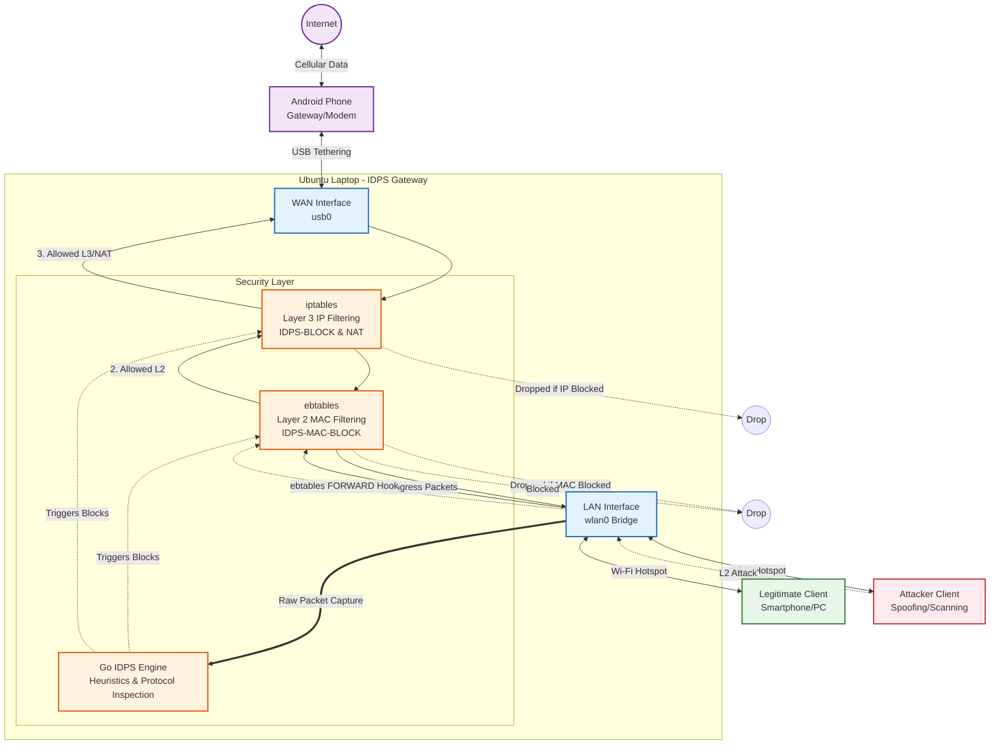

# IDPS Network & Security Topology

This document illustrates the designed deployment topology for the IDPS Gateway, mapping out the physical interfaces, network flow, and the multi-layered security architecture.

## Network Architecture Flowchart

## Topology Details

1. **Hardware & Interfaces:**
   - The system is designed to run on a central gateway, such as an Ubuntu Laptop.
   - **WAN (`usb0`)**: External internet access is provided via USB tethering to a mobile device.
   - **LAN (`wlan0`)**: The laptop broadcasts a Wi-Fi Hotspot. NetworkManager typically bridges this connection, allowing devices to join the local subnet.

2. **Traffic Capture (Detection):**
   - The **Go IDPS Engine** listens in promiscuous mode on the LAN interface (`wlan0`).
   - It captures raw packets dynamically, feeding them into the heuristic engine (SYN floods, MAC spoofing, DHCP starvation) and protocol inspectors (DNS, HTTP).

3. **Multi-Layer Prevention (Blocking):**
   - **Layer 2 (ebtables)**: Placed directly on the bridge. If an attacker is identified, their hardware MAC address is inserted into the `IDPS-MAC-BLOCK` chain. This prevents the attacker from accessing the gateway *and* prevents them from laterally attacking other clients on the same Wi-Fi network.
   - **Layer 3 (iptables)**: Handles Network Address Translation (NAT) so LAN clients can reach the internet. It also contains IP-based `IDPS-BLOCK` rules in the `FORWARD` and `INPUT` chains as an additional fallback layer of defense.
